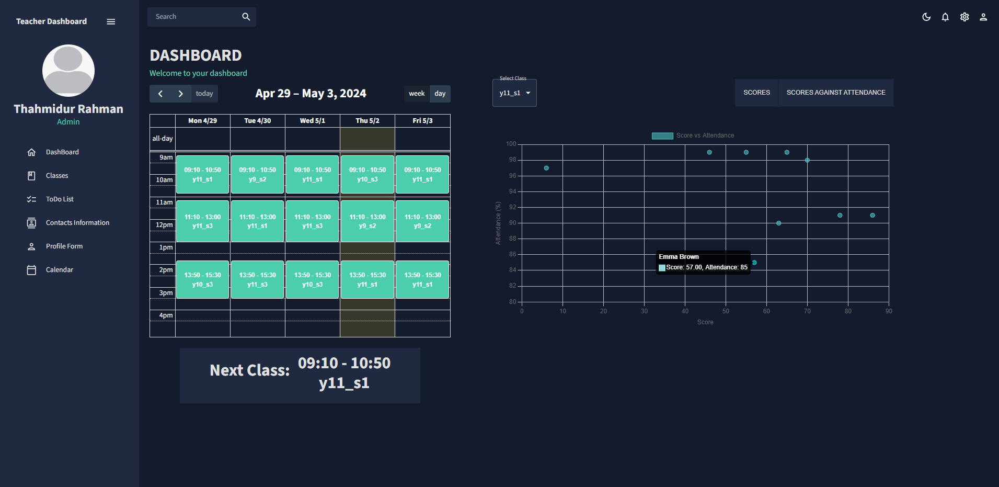
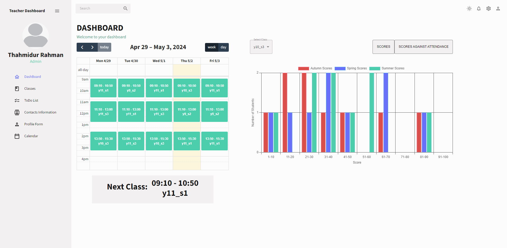
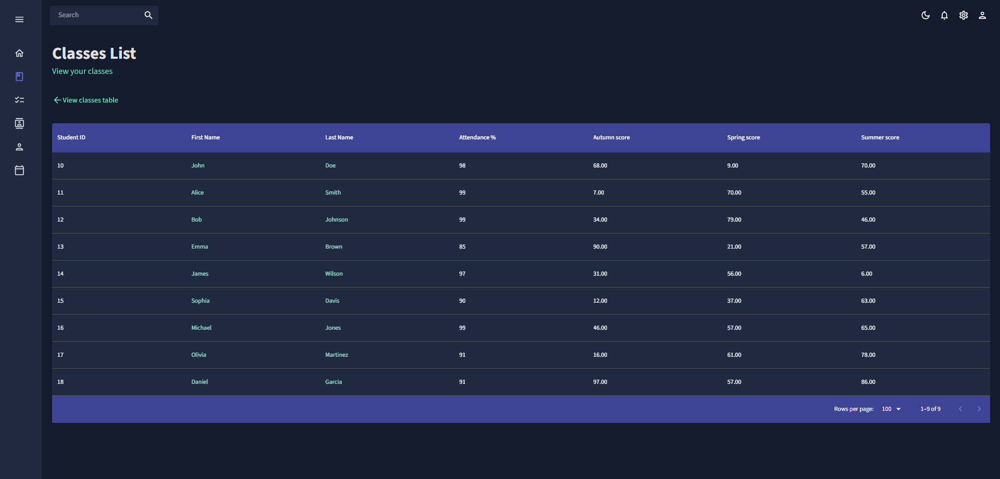
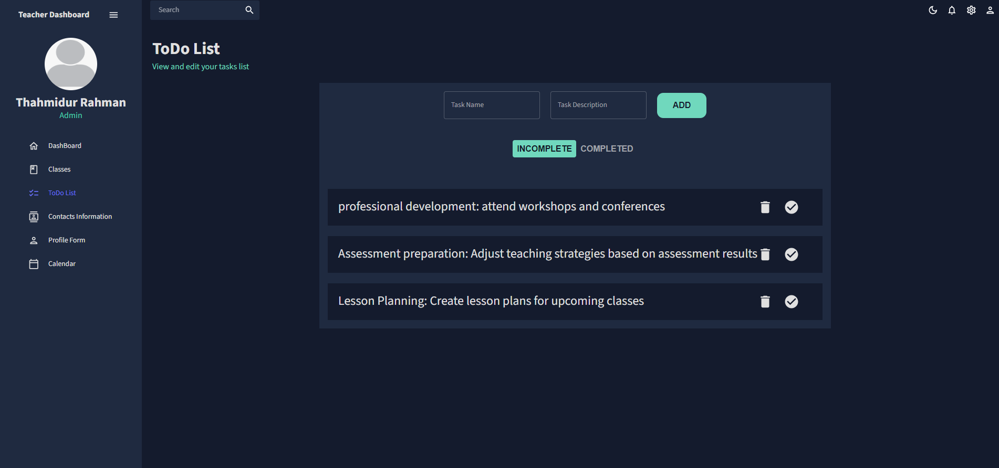
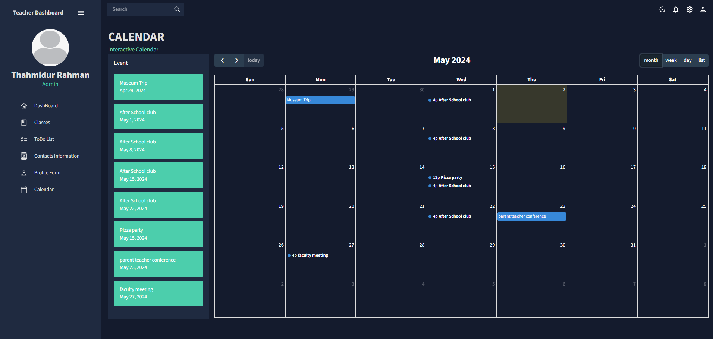

# Teacher Dashboard app

This project was completed to enhance my React skills and create a visually appealing website. It serves as a demonstration of my proficiency in frontend development with React.

## Technologies Used

- **Frontend**: React.js 
- **Backend**: Node.js
- **Database**: PostgreSQL

## Description

This project is a web application built with React.js, aiming to showcase my abilities in creating modern and dynamic user interfaces. By using React, I aimed to create a smooth and interactive user experience while demonstrating proficiency in managing state, handling user inputs, and organizing components effectively. Material-UI components were used for consistent styling, including the datagrid to display data in a tabular format. React Pro Sidebar was used to build the sidebar,and FullCalendar was used to integrate a calendar feature. 

The backend of this application is powered by Node.js, providing the necessary server-side functionalities. I utilized Node.js to handle requests, manage data flow, and ensure the communication between the frontend and the database.

For data storage, this project uses PostgreSQL. 

## Features
The program starts at the homepage of a user, who is imagined to be a teacher. On the homepage they can view their timetable and also select a class and view metrics like score or score vs attendance for the selected class. Data like classes, students, which students belongs to which class, the scores in that class and who teaches the class is stored appropriately in a database. The data is fetched and then displayed.

The program has a light and dark mode setting and contains a collapsable sidebar created using react-pro-sidebar.

### View Classes feature

The classes option on the side bar takes the user to a page where they can view all the classes they teach. By clicking on a class they are then able to view information from the database about the student in the selected class. Currently the student's attendance and scores are the only recorded metrics. These are stored in a table called student_classes, which takes a student_id and class_id that references the student table (storing student name and id) and the class table (stores class name, the teacher, class id and subject), and stores the corresponding score and attendance. Thus it is easy to add metrics that you wish to be displayed as you only need to add a column to this table and it will be displayed automatically. 

### ToDo List

The app contains a ToDo list feature. Users can list down tasks that need to be completed. They are able to delete tasks or mark them as complete. Users can also view completed tasks by clicking on the completed section.

### Calendar

There is also a page to view a calendar created using fullCalendar. Using this, a user can save events onto a calendar. They are able to drag and drop their events around and also delete them. 

