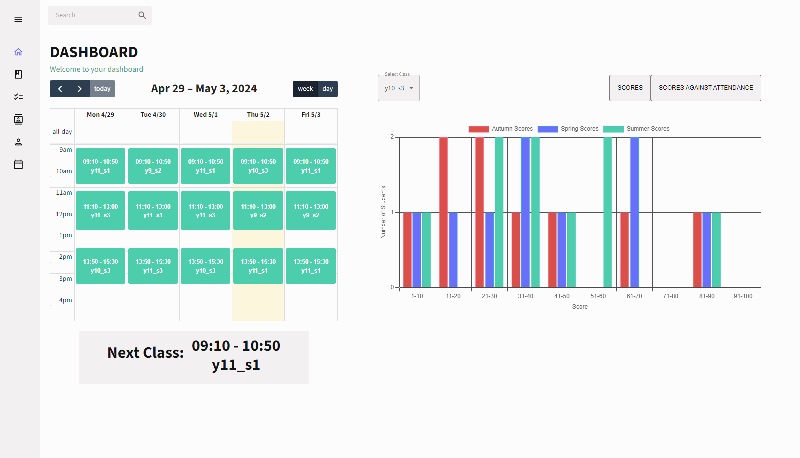

# Teacher Dashboard app

This project was completed to enhance my React skills and create a visually appealing website. It serves as a demonstration of my proficiency in frontend development with React.

## Technologies Used

- **Frontend**: React.js
- **Backend**: Node.js
- **Database**: PostgreSQL

## Description

This project is a web application built with React.js, aiming to showcase my abilities in creating modern and dynamic user interfaces. By using React, I aimed to create a smooth and interactive user experience while demonstrating proficiency in managing state, handling user inputs, and organizing components effectively.

The backend of this application is powered by Node.js, providing the necessary server-side functionalities. I utilized Node.js to handle requests, manage data flow, and ensure the communication between the frontend and the database.

For data storage, this project uses PostgreSQL. 

## Features
The program starts at the homepage of a user, who is imagined to be a teacher. On the homepage they can view their timetable and also select a class and view metrics like score or score vs attendance for the selected class. Data like classes, students, which students belongs to which class, the scores in that class and who teaches the class is stored appropriately in a database. The data is fetched and then displayed.

The program has a light and dark mode setting and contains a collapsable sidebar created using react-pro-sidebar.

